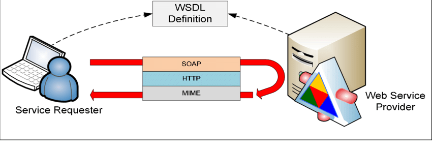

# XML & WEB SERVICES

 

 

Welcome to the subject XML & Web Services in the University of Novi Sad (Serbia) for Erasmus International Students. I hope that learn about it will be so fun.

GitHub will be our humble abode.

 

It is the content of the course:

1. XML and XML related related technologies (XML, XML Schema, XSLT, XPath).
2. Service Oriented Architectures and SOA patterns.
3. Web services (WSDL, SOAP).
4. RestFull services (REST concept + JSON).
5. Microservices and Microservice architectures patterns.
6. GraphQL.
7. Basics of cloud services.